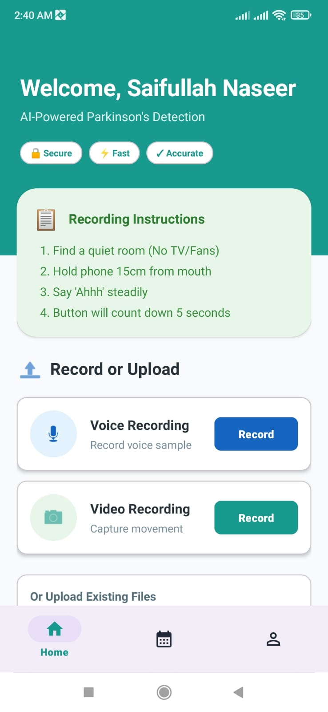
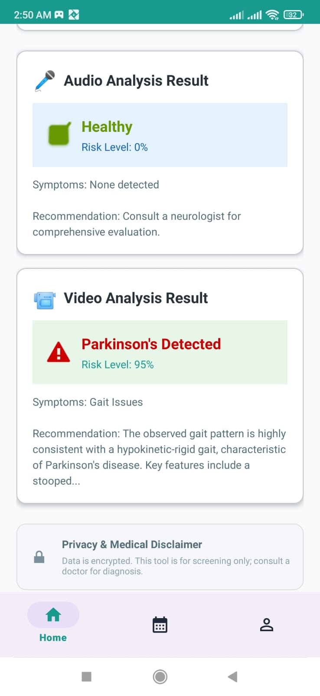
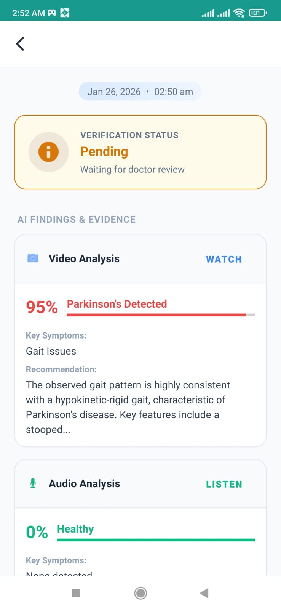
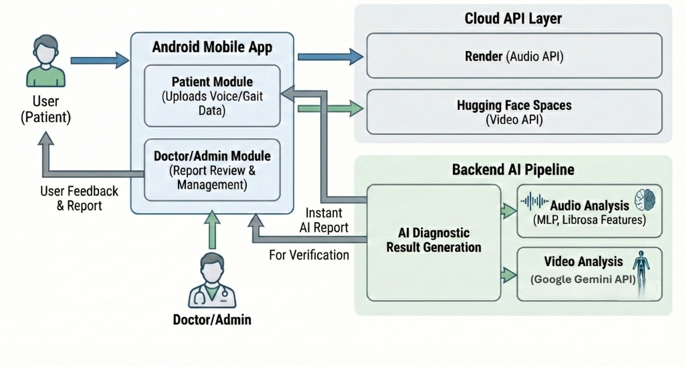

# 🏥 Parkinson’s Disease Detection System (Android + AI)

### 🚀 Overview
A Native Android Application designed for early detection of Parkinson’s Disease using non-invasive methods. The system utilizes **Generative AI (Google Gemini 1.5 Pro)** and **Computer Vision (MediaPipe)** to analyze patient gait (walking patterns) and voice tremors.

---

### 📸 App Interface
*(Visual showcase of the application)*

| Dashboard (Home) | AI Analysis Result | Risk Report (Result) |
|:---:|:---:|:---:|
|  |  |  |

---

### 🏗️ System Architecture
*(How the data flows from App to Cloud)*

---

### 🔗 Backend 

🔹 **Backend API:** The Python logic is deployed on Render. You can view the API code here:  
👉 **[View Python API Repository](https://github.com/SaifullahCodes/parkinson-api)**

### 📄 Project Documentation & Case Study
The detailed technical documentation and research findings are available here:

👉 **[Click to View / Download Full Case Study PDF](./Parkinson_Detection_System_Showcase.pdf)**

---

### 🛠️ Tech Stack
- **Frontend:** Native Android (Java), MVVM.
- **AI Models:** Google Gemini 1.5 Pro, MediaPipe Pose, Custom MLP (Audio).
- **Backend:** Firebase Firestore, Flask API (Hosted on Render/HuggingFace).

> **Note:** Since the backend is on a Free Tier (Render), the first request might take **30-60 seconds** to wake up the server.

---

### ⚠️ COPYRIGHT & LICENSE

**© 2026 Saifullah Naseer. All Rights Reserved.**

1. **Viewing Only:** Recruiters and students can view this code for educational evaluation.
2. **No Commercial Use:** You are **NOT** allowed to use this code for paid projects or startups.
3. **Strictly No Copying:** Cloning this repo for submission as your own FYP is prohibited.

**Contact:** saifullah.naseer.dev@gmail.com
